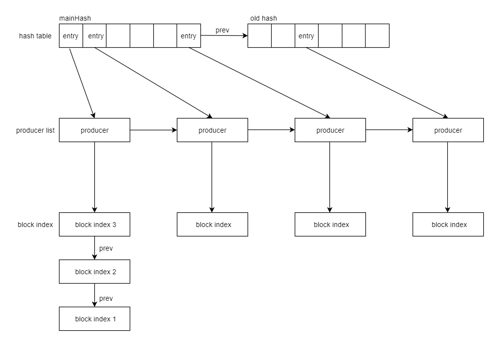
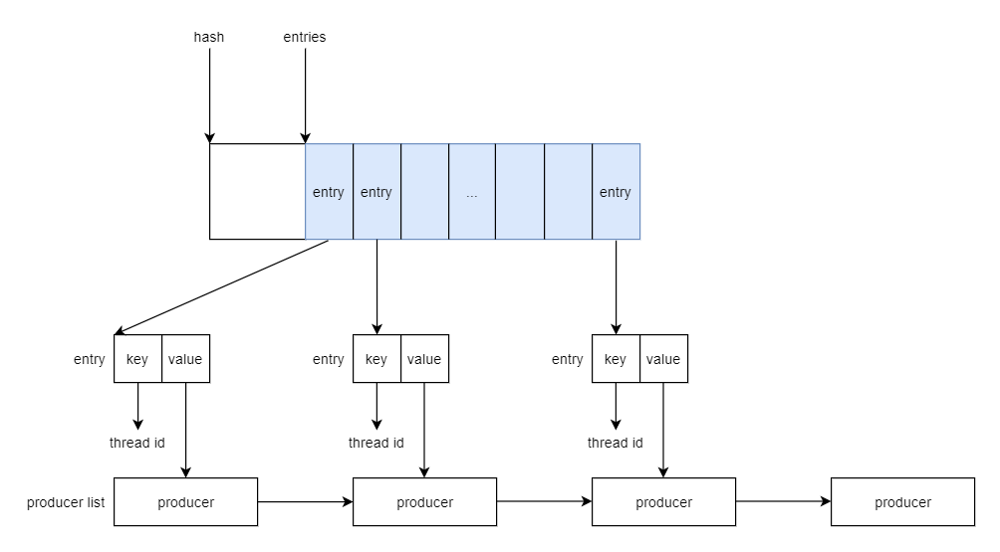
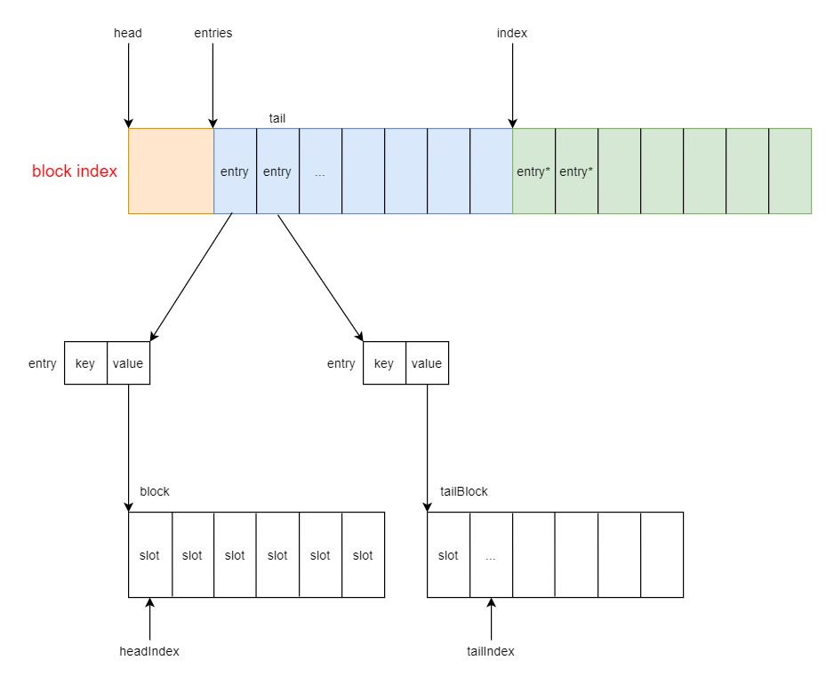
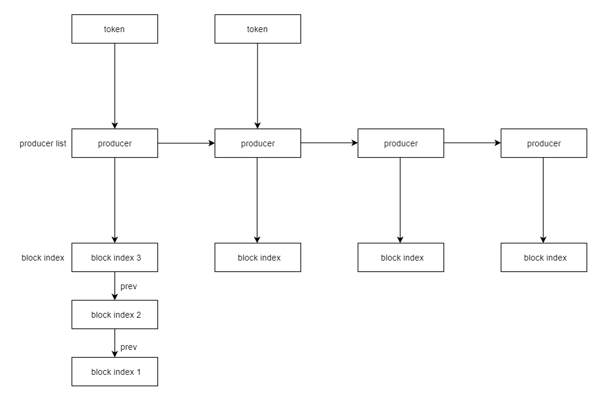
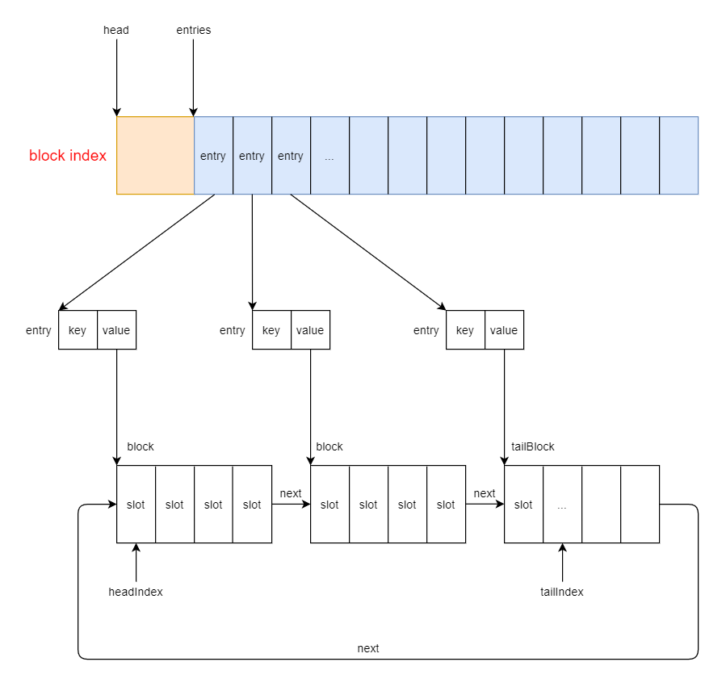

# concurrentqueue 设计文档

## 概要介绍

concurrentqueue 是一个 MPMC 的队列，实际上是由一系列 SPMC 队列组成，每一个生产者都有一个 SPMC 队列。

concurrentqueue 的底层提供了两种实现机制，分别是基于无锁哈希表管理的隐式生产者队列和基于令牌 token 管理的显式生产者队列。如果用户为生产者提供了令牌，则会为每个生产者线程创建一个显式队列；如果没有提供令牌，则会为每个生产者线程创建一个隐式队列。

显式队列的生命周期和令牌 token 关联，隐式队列的生命周期和整个 MPMC 队列关联。

## 隐式生产者队列

隐式生产者队列的基本结构如下：

上面结构有三个关键部分：
1. hash table：无锁哈希表，key 为线程 ID，value 为 producer 指针，可通过线程 id 索引到对应的 producer
2. producer list：生产者链表，所有的生产者串联成链表的形式
3. block index：SPMC 队列

### lock-free hash table

无锁哈希表的基本结构如下：

无锁哈希表的每一个元素都是一个 KV 键值对，key 为线程 ID，value 为指向隐式生产者的指针。无锁哈希表用于线程 ID 映射到隐式生产者。

当隐式生产者进行入队操作的时候，首先根据线程 ID 查找无锁哈希表，判断该生产者是否已经存在。如果隐式生产者已经存在，则返回对应的生产者，后续将在该生产者的SPMC队列上进行入队操作；如果不存在，则会创建新的生产者，创建SPMC队列，并将线程 ID 写入到哈希表中之后再进行入队操作。

使用原子计数统计哈希表中生产者的数量，当生产者的数量超过哈希表数量的一半，就会尝试进行哈希表的扩容操作（分配新的哈希表）。新分配的哈希表通过 prev 指针连接到老的哈希表。新申请的哈希表是原来哈希表大小的两倍，并且会通过再散列的方式将老的哈希表中的元素重新散列到新的哈希表中。

### producer list

整个 MPMC 实际上是由一系列的 SPMC 组织起来的，对于不同类型的队列（显式或者隐式），虽然管理 SPMC 的方式不同，但是多个生产者之间通过 next 指针（实际上是 prev 指针）链接成单链表。当产生一个新的生产者的时候，会使用 CAS 操作添加到原来单链表的尾部。一旦生产者被添加到链表中，它将永远不会被删除，只会被标记为非活动的。

### block index

block index 的基本结构如下：

blockIndex 中的 entries 是一个数组，其数组的每一个元素都是 `BlockIndexEntry`（后面简称 entry）。每个 entry 都是一个KV键值对，Key 是 entries 的下标索引，Value 是指向 block 的指针。

隐式生产者队列和显式生产者队列继承于 `ProducerBase`。`ProducerBase` 维护着两个索引 `headIndex` 和 `tailIndex`，分别指向 blockIndex 中元素出队和元素入队的位置。同时维护着指向 tail block 的指针 `tailBlock`，指向最新的未被填充满的 block。

每个 block 是一个大小为 BLOCK_SIZE 的数组，通过 headIndex 和 tailIndex 索引其元素。blockIndex 中所有 block 中的 index 序号是连续的（假如入队的元素数量为 9999，那么等所有元素入队之后 tailIndex 为 9999）。也就是说，在入队和出队的操作过程中，headIndex 和 tailIndex 会不断递增，但是并不会造成 block 的非法访问（通过和掩码的&操作）。保持 index 连续，这样设计的好处在于给定一个 index，可以通过偏移量计算出这个 index 对应着哪一个 entry。

入队操作时，读取 tailIndex 的值，tailIndex 表示下一个即将入队的 slot，判断是否到达当前 block 的末尾（即判断当前 block 是否已满）。如果未满，直接在该 block 入队，并更新 tailIndex；如果当前 block 已满，需要从 block pool 中申请新的 newBlock，插入到 block index 中，在 newBlock 中进行入队操作，并更新 tailIndex、 tailBlock 以及 tail。tailIndex 总是增加（除非溢出或者环绕），入队操作只有一个线程在更新对应的变量。

出队操作时，读取 headIndex，headIndex 表示即将出队的 slot，通过 headIndex 计算得到对应的 entry，然后可以得到出队的 block。对 headIndex 的元素出队之后，更新 headIndex。当 block 中的最后一个元素出队之后，需要将该 block 从 block index 中删除（但是由于另一个消费者可能仍然在使用这个 block，比如计算偏移量，所以并没有直接从 block index 中删除该 block，但是 block 指针被置为空，表明当前这个 entries 的 slot 可以被重用），并将该 block 返回给 block pool。出队操作可能是并发的，所以 headIndex 由多个消费者进行原子性的递增。

预期之内的情况是，headIndex 和 tailIndex 最终会溢出。

由于出队操作可能存在潜在的并发操作（多个线程会更新 headIndex），为了防止出队操作时 headIndex 超过 tailIndex，队列里维护了一个原子的出队计数 `dequeueOptimisticCount`，表示出队元素的数量。但是出队计数 dequeueOptimisticCount 是乐观的，当消费者认为有元素可以出队时，该计数就会增加。如果自增后的 dequeueOptimisticCount 值小于 tailIndex，则保证至少有一个元素可以出队（考虑到并发），也就是说，确定了 headIndex 小于 tailIndex，那么增加 headIndex 就是安全的。

另一方面，如果 `dequeueOptimisticCount` 增加后超过（或等于）tailIndex 的值（说明已经有其他线程将队列中的所有元素全部出队），则出队操作会失败。此时可以通过递减 dequeueOptimisticCount 的值以使它最终与队列计数保持一致，但是为了增加并行性并保持所有涉及到的变量单调递增，这里选择增加 `dequeueOvercommit` 计数器。可以通过 `dequeueOptimisticCount` 减去 `dequeueOvercommit` 的值最终得到我们想要的实际出队的元素数量。

### block pool

concurrentqueue 的 block pool 有两种不同的表现形式：数组和链表。在 concurrentqueue 的构造函数中，它是按照 block count 预先分配的初始数组。在入队操作时，每次申请 block 都是从这个初始数组中进行分配，一旦数组内存消耗殆尽，这个 block pool 将永远空着。在出队操作的时候，当某个 block 中的元素全部出队，即 block 为空的时候，会将 block 返回给 free-list，free-list 是一个 lock-free 的单链表（不是 wait-free 的）。free-list 管理的 block 是可以被重用的，入队操作申请 block 之前会优先去重用 free-list 中的 block。

free-list 避免 ABA 问题：https://moodycamel.com/blog/2014/solving-the-aba-problem-for-lock-free-free-lists.htm

## 显式生产者队列

显式生产者队列的基本结构如下:

### token

如果用户为生产者提供了令牌 token，则会创建一个显式的生产者队列。显式生产者队列通过令牌 token 来管理生产者的生命周期。一个 token 对应着一个 producer，并且对应着一个 SPMC。由于令牌包含的数据相当于特定线程的数据，因此不应该在多个线程中使用它们。

### block index

显式生产者队列是一个 block 循环单链表。一旦一个 block 被添加到显式生产者队列的循环链表中，它将永远不会被删除。生产者维护着 tail block 指针，它指向当前要插入元素的 block；当 tail block 被填满时，将检查下一个 block 是否为空。如果下一个 block 是空的，则将 tail block 指向该 block；否则申请一个新的 block 并将其插入到循环链表的尾部，然后更新 tail block 指向这个新的 block。

当一个元素从完全从 block 中退出时，就设置标志表示这个 slot 为 emtpy。生产者通过检查这些标志来判断 block 是否为空。如果 BLOCK_SIZE 很小，可以通过检查标志的方式来判断 block 是否为空；如果 BLOCK_SIZE 很大，则需要通过原子变量来判断。

当整个 block 中所有元素完成出队，就表示该 block 可以被重用，在元素入队的时候，如果 block 被填满，可以优先考虑重用该 block。

入队操作时，读取 tailIndex 的值，tailIndex 表示下一个即将入队的 slot，判断是否到达当前 block 的末尾（即判断当前 block 是否已满）。如果未满，直接在该 block 的 tailIndex 位置入队，并更新 tailIndex；如果当前 block 已满，判断 tail block 的下一个 block 是否可以重用（即 tail block 的下一个 block 为空），如果可以重用，优先重用下一个空的 block，更新 tail block 为下一个 block；如果不为空，说明当前 block 的循环单链表已经填满了，我们需要申请一个新的 block 并插入到循环单链表中。申请新的 block 需要判断当前 block index 中是否还有足够的内存可以申请一个新的 block，如果有足够的内存，则申请一个新的 block，并插入到循环链表的尾部，并且更新 tailBlock 指针；如果当前 block index 中已经没有足够的内存，则需要申请一个新的 block index，新申请的 block index 的大小是原来大小的两倍，并通过 prev 指针和原来的 block index 连接成链表。

可以将每个 block 视为一个数组，由于多个 block 组成了循环链表，所以可以将多个 block 组成的环状单链表看做一个循环缓冲区。

显式队列维护了一个 `pr_blockIndexSlotsUsed` 变量，表示已经被使用的 block 的数量，该变量由生产者进行维护，消费者可以读取但是不能写入。

出队操作时，读取 headIndex，根据 headIndex 计算得到即将要出队的 block，然后对该 block 中下标为 headIndex 的元素出队。元素出队完成后，会将该 slot 的标志位设置为空（元素入队的时候可以根据这个标志位来判断是否可以重用 block）。

显式生产者的 producer list、block pool 的设计思路和隐式生产者的保持一致。

## 参考文档

[Detailed Design of a Lock-Free Queue](https://moodycamel.com/blog/2014/detailed-design-of-a-lock-free-queue.htm)